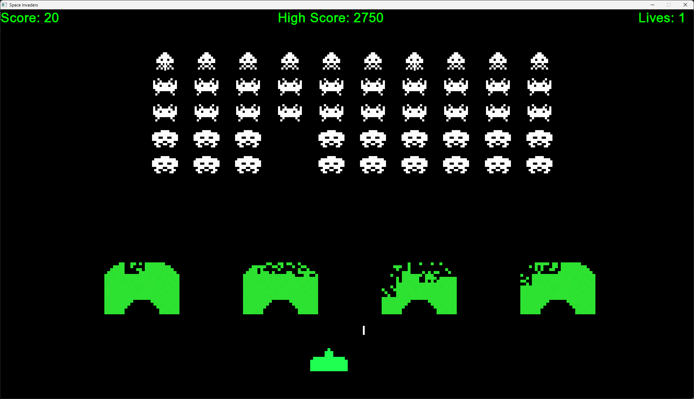

# Space Invaders

Space Invaders is a modern take on the classic arcade game, built using C++ and the SFML library. Relive the nostalgic gameplay of the original while enjoying smooth, responsive graphics and sound!



## Installation

### Prerequisites

- A C++ compiler supporting C++11 (or later).
- [SFML](https://www.sfml-dev.org/) (Simple and Fast Multimedia Library).

### Building from Source

1. **Clone the repository:**
    ```bash
    git clone https://github.com/yourusername/space-invaders.git
    cd space-invaders
    ```

2. **Compile the project:**

   You can compile the project using your preferred method. For example, using `g++`:
    ```bash
    g++ -std=c++11 -I/path/to/SFML/include -L/path/to/SFML/lib -o space_invaders src/*.cpp -lsfml-graphics -lsfml-window -lsfml-system
    ```

   Or, if you prefer using CMake:
    ```bash
    mkdir build && cd build
    cmake ..
    make
    ```

3. **Run the game:**
    ```bash
    cd bin
    ./space_invaders
    ```

## Usage

Once compiled, run the game binary to start playing. Use the controls below to navigate your spaceship, fire at invading aliens, and try to beat your high score.

## Controls

- **Arrow Keys:** Move your spaceship left and right.
- **Spacebar:** Fire your weapon.
- **Escape:** Pause or exit the game.

## License

This project is licensed under the [MIT License](LICENSE).

## Acknowledgements
- Inspired by the original [Space Invaders](https://en.wikipedia.org/wiki/Space_Invaders) arcade game.
